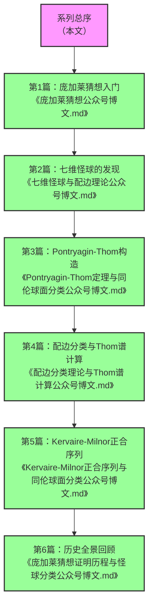

> 本系列文章带你从零开始理解20世纪最伟大的数学成就之一：微分拓扑的建立与高维流形分类的完整图景，从庞加莱1904年提出的著名猜想出发，一步步走到Kervaire-Milnor同伦球面分类的优美框架，领略数论、代数拓扑与微分拓扑的深刻联系。

---

## 系列文章逻辑关系与阅读顺序
这个系列的6篇文章构成了一个完整的知识体系，从基础概念到前沿成果，层层递进：

---

### 各篇内容定位与承接关系
#### 第1篇：基础概念篇 · 庞加莱猜想
**核心内容**：广义庞加莱猜想定义、同伦判定工具、反例说明、光滑版本猜想进展、Handle分解理论、h-配边定理及各维数证明历程
**作用**：建立最基础的拓扑直觉，理解"流形"、"同胚"、"微分同胚"等核心概念，提出我们要解决的核心问题：高维球面是否存在不同的光滑结构？

#### 第2篇：现象引入篇 · 七维怪球与配边理论
**核心内容**：七维怪球28个微分同胚类结论、流形四层分类体系（同伦/同胚/微分同胚/配边）、配边理论介绍、Pontryagin-Thom定理解析、怪球数量推导逻辑、学科影响
**作用**：抛出"七维怪球"这个反直觉的数学发现，激发读者兴趣，引入"配边"这个核心工具，建立流形分类的四层框架。

#### 第3篇：核心构造篇 · Pontryagin-Thom定理
**核心内容**：稳定可平行化流形定义、Framed流形概念、Framed配边群与球面稳定同伦群关联、Pontryagin-Thom定理解析、Kervaire-Milnor正合序列逻辑、七维同伦球面28个微分同胚类的推导过程
**作用**：详细讲解连接几何与代数拓扑的核心桥梁——Pontryagin-Thom构造，理解为什么流形的几何分类可以转化为代数拓扑中的同伦群计算。

#### 第4篇：计算框架篇 · 配边分类与Thom谱计算
**核心内容**：配边分类与法丛关联逻辑、无向/定向/framed/复配边环的完整结构结果、配边环六步计算框架（分类空间同调→Thom同构→确定Steenrod代数模结构→Adams谱序列E2页计算→谱序列塌陷→得到Thom谱同伦群）、Pontryagin-Thom定理核心对应关系、配边理论多领域应用
**作用**：进入更抽象的代数拓扑层面，讲解如何系统计算配边群，介绍现代同伦论的核心工具谱序列，为下一篇的同伦球面群计算做准备。

#### 第5篇：分类应用篇 · Kervaire-Milnor正合序列
**核心内容**：Kervaire-Milnor正合序列完整框架、Kervaire不变量问题最新进展、J同态与伯努利数的关系、同伦球面群阶数计算公式、6维和7维同伦球面群计算实例
**作用**：将前面所有工具整合起来，展示如何用Kervaire-Milnor正合序列完整计算同伦球面群，揭示数论与拓扑的深刻联系。

#### 第6篇：历史全景篇 · 庞加莱猜想证明历程与怪球分类
**核心内容**：广义庞加莱猜想各维数证明历程（n<3平凡、n≥5由Smale/Newman证明、n=4由Freedman证明、n=3由Perelman通过几何化猜想证明）、光滑庞加莱猜想反例（Milnor1956年发现七维怪球）、不同维数光滑结构情况、Kervaire-Milnor群定义与结构、定向配边群关联说明
**作用**：从历史发展的角度梳理整个领域的发展脉络，将技术细节放回历史语境中，让读者理解这些数学成果是如何一步步被发现的。

---

## 怪球分类完整结果（补充内容）
很多读者关心各维数球面的光滑结构数量，这里我们整理了所有已知维数的结果：

| 维数n | 同伦球面群$\Theta_n$ | 光滑结构数量 | 备注 |
|-------|---------------------|--------------|------|
| 1 | 0 | 1 | 圆周只有唯一光滑结构 |
| 2 | 0 | 1 | 2维球面只有唯一光滑结构 |
| 3 | ？ | 1？ | 三维光滑庞加莱猜想（Perelman证明），但同伦球面群$\Theta_3$是否平凡仍有争议 |
| 4 | ？ | 未知 | 四维光滑庞加莱猜想仍是开问题，不知道$S^4$上是否存在怪球 |
| 5 | 0 | 1 | 唯一光滑结构 |
| 6 | 0 | 1 | 唯一光滑结构（Kervaire不变量非零导致） |
| 7 | $\mathbb{Z}/28$ | 28 | 最著名的怪球维数，Milnor1956年发现 |
| 8 | 0 | 1 | 唯一光滑结构 |
| 9 | $\mathbb{Z}/2 \oplus \mathbb{Z}/2 \oplus \mathbb{Z}/2$ | 8 | 有8种不同的光滑结构 |
| 10 | $\mathbb{Z}/6$ | 6 | 有6种不同的光滑结构 |
| 11 | $\mathbb{Z}/992$ | 992 | 光滑结构数量暴增到992种 |
| 12 | 0 | 1 | 唯一光滑结构 |
| 13 | $\mathbb{Z}/3$ | 3 | 有3种不同的光滑结构 |
| 14 | $\mathbb{Z}/2$ | 2 | Kervaire不变量非零的维数，有2种光滑结构 |
| 15 | $\mathbb{Z}/8128 \oplus \mathbb{Z}/2$ | 16256 | 光滑结构数量超过1.6万种 |

> 注：15维的8128是完全数，再次展现了数论与拓扑的奇妙联系。

---

## 系列特色
1. **严谨性与通俗性平衡**：既保持数学的严格性，所有核心定理和公式都准确无误，又用通俗的语言解释抽象概念，避免过多的专业术语堆砌
2. **逻辑连贯层层递进**：从问题提出到工具引入，再到核心定理证明和应用，符合认知规律
3. **内容前沿**：包含2024年最新的Kervaire不变量问题的突破成果，体现领域最新进展
4. **移动端适配**：所有公式采用行内与展示公式结合的方式，段落短、重点突出，适合手机阅读
5. **交叉视角**：不仅讲解拓扑学内容，还展示数学不同分支的深刻联系，拓宽视野

---

> 本系列作者 [你的名字]，首发于微信公众号 [你的公众号名称]，转载请注明出处。
> 后续将推出四维流形、量子拓扑等相关主题文章，敬请关注。
